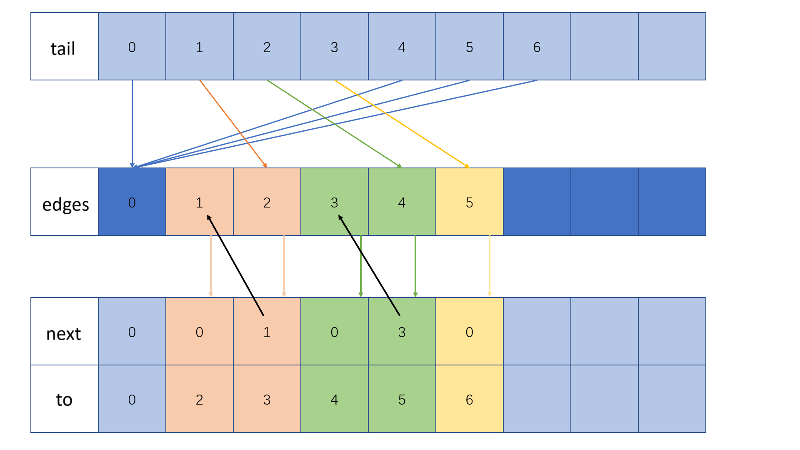
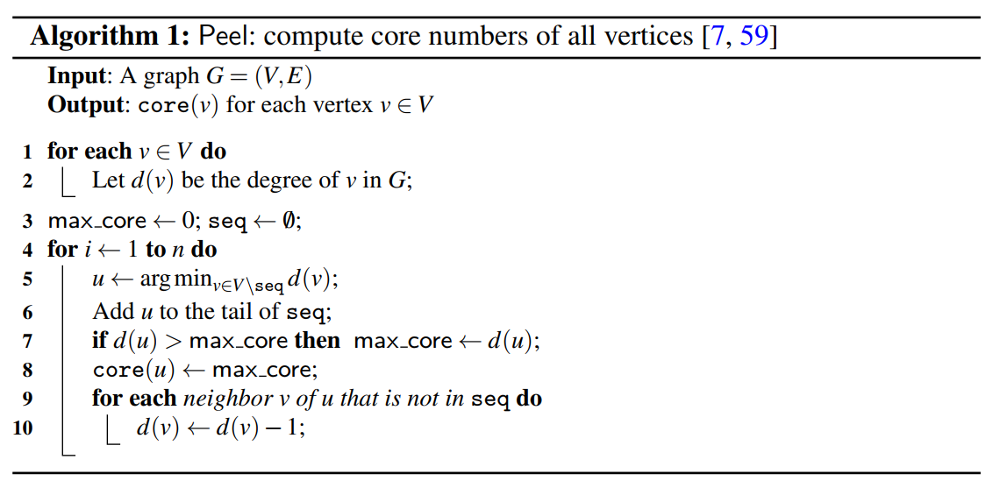
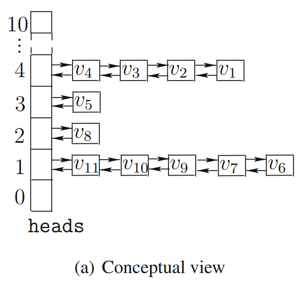

# Basic Application of Graph and Peeling Algorithm

## File Structure

```
.
├── Graph
│   ├── Graph.cpp                   # source code of the program
│   ├── Graph.h                     # source code of the program
│   ├── Graph.vcxproj               # Visual Studio config file
│   ├── Graph.vcxproj.filters       # Visual Studio config file
│   ├── ListLinearHeap.cpp          # source code of the program
│   ├── ListLinearHeap.h            # source code of the program
│   ├── Makefile                    # makefile
│   ├── main.cpp                    # source code of the program
│   └── test_files                  # include some files for testing
│       ├── test_1.txt
│       ├── test_1_2_3_picture.png
│       ├── test_2.txt
│       └── test_3.txt
├── Graph.sln                       # Visual Studio solution file
├── README.md                       # README markdown file
└── images                          # save some pictures used in README.md
    ├── adjacency_lists_based_on_linked_list.png
    ├── linked_list_based_linear_heap.png
    └── peeling_algorithm.png
```

## Some Explanations

### The Usage of Makefile

In the path `./Graph/Graph`, there's a Makefile here. The usage is shown below:

```
$ make              # build the executable file
$ make clean        # remove the executable file
$ make test_*       # * can be 1, 2 and 3. use test files in ./Graph/Graph/test_files to test
```

### Input from Terminal

If you don't want to input from text file, run the executable file directly. Here is the input rule:

1. The fist line is composed of two positive numbers `n` and `m`, among which the first represents the maximun number of lines to input next, while the second represents the number of graphs used.

2. In the following `n` lines, you can input a command each line. The format is shown below:

   - `A <i> <f> <t> <v>`: add an edge valued `v` from `f` to `t` to the `i`-indexed graph
   - `D <i> <f> <t>`: delete the edge of the `i`-indexed graph from `f` to `t`
   - `G <i>`: use Peeling Algorithm to calculate core_number of each vertex in the `i`-indexed graph
   - `M <i> <oi>`: merge the `oi`-indexed graph into the `i`-indexed graph
   - `P <i>`: print details of edges and core_numbers of the `i`-indexed graph
   - `Q`: quit the process of inputting
   - `S <i> <oi> <k>`: get the `k`-core sub-graph of the `i`-indexed graph and assign it to the `oi`-indexed graph (ATTENTION! please input `P <i>` first before inputting this command)

## My Solution to the First Task

### The Structure of My Graph

As we all know, there're lots of methods to store a graph <V, E>, some of which are most used like adjacency lists, adjacency matrices, and edge lists. The advantages and disadvantages of these data structures are clear:

**Adjacency lists** store all edges in a list of vectors. Howerver, it has **a relatively high time complexity of `O(E)`** for searching for an edge and **not-that-great memory cost** (better than adjacency matrices though) due to dynamic memory allocation of too much vectors. Especially in a dense graph, the time cost of this data structure will be much more than adjacency matrices.

**Adjacency matrices** use a large n $\times$ n `0-1` matrix to store a graph, with `mat[x][y] == 1` representing there is an edge from `x` to `y`, otherwise the opposite. Although the time complexity of **searching for an edge is `O(1)`**, the memory complexity of this data structure is **too high (`O(V^2)`) to accept in a loose graph**.

Therefore, in this program, I used **adjacency lists based on linked list** to store the edge. On the one hand, the graph for Fraud Detection will be **more of a loose graph in most areas** (except for the area to be "fraud"). On the other hand, using **adjacency lists based on linked list** will save more memory than "pure" adjacency lists because there's only one vector to store all edges and another vector to store the tail of each "linked list". The basic principle of this data structure is illustrated below:



Let's have an eye on the edge emitted from the vertex `2`. First, we get the index of last edge emitted from the vertex `2` from the vector `tail` to be `4`. Next, we find the forth edge in the vector `edges` and get `next` index of it. By using the index representing the third edge in the verctor `edges`, we get the next edge emitted from the vertex. Repeating the operations above until meeting the end, we get all edges emitted from the vertex.

### Using Hash Method to Transform from Key to Index

From the illustrations above, we quickly find there's a question that if the representations of vertexes are not numbers, we wouldn't use the indexes of the vector to represent the vertexs. Nevertheless, there's a very useful method - **hash method** - to map each node to a specific index. By using hash method, we can easily store a graph into our data structure (however, the vertex should be hashable).

### The Merging Operation of My Graph

Actually the merging operation is easy to implement. Because all edges in my graph are stored in one vector, what we need to do are **iterating through all edges of the merged graph and then inserting them into the merging graph**. So, the only problem is to avoid inserting a vertex or an edge repeatedly.

The method I used in my program is **hash method**, too. If I iterate through all edges and remove those repeated edge, there wiil be a very high time cost. So, I used a `unordered_set`, which save strings like `1-2` representing an edge emitted from the vertex indexed `1` to that indexed `2`. Due to **the hashability of strings and the uniqueness of the indexes of vertexes**, this method is proved to be feasible.

## My Solution to the Second Task

### Apply Peeling Algorithm to My Graph

The priciple of Peeling Algorithm is to **remove the vertex which has the least degree in the graph** one by one. We will use a variable `max_core` (initialized to be zero, as the degree of a vertex is at least zero) to record the max core number of the current graph. If the to-be-removed vertex has a degree more than that, we should update `max_core` with the degree of the vertex and **then decide the `core_number` of this vertex is `max_core`**. Otherwise, there must be a already-removed vertex which has decreased the degree of the currently to-be-moved vertex because the degrees of all adjacent vertexes of the already-removed vertex has been decreased by one. So under this circumstance, we **assign the `core_number` of the to-be-removed vertex to be `max_core` and leave `max_core` unchanged**.

The steps of the algorithm are shown below (captured from chapter 3.1 of [Cohesive Subgraph Computation over Large Sparse Graphs: Algorithms, Data Structures, and Programming Techniques](https://doi.org/10.1007/978-3-030-03599-0):



### Using Linked List Based Linear Heap to Optimize Peeling Algorithm

It's easy to find that the time complexity of the algorithm above is `O(V^2+E)`. By referring to chapter 2.1 and 3.2 of [Cohesive Subgraph Computation over Large Sparse Graphs: Algorithms, Data Structures, and Programming Techniques](https://doi.org/10.1007/978-3-030-03599-0), I used **Linked List Based Linear Heap to decrease the time complexity to `O(V+E)`**.

The data structure of Linked List Based Linear Heap are shown below (captured from chapter 2.1 of [Cohesive Subgraph Computation over Large Sparse Graphs: Algorithms, Data Structures, and Programming Techniques](https://doi.org/10.1007/978-3-030-03599-0):



**The operations of insertion, deletion and modification of this heap have a time complexity of `O(1)`**. What's to be mentioned is that this structure only cares about key values of elements **instead of the sequence of them** (especially in the process of modification, the sequence will be rearranged to a large extent). And during the process of implementing Peeling Algorithm, we also only care about the degrees of vertexes instead of their sequence. Thus, this data structure would help a lot.

This way, the operations of finding the vertex having the least degree, removing the vertex from the heap and modifying all adjacent vertexes have a time complexity of `O(1)` in every unit. **The time complexity of Peeling Algorithm is decreased to `O(V+E)` (because all edges and vertexs will be iterated only once)**.

## The Entire Problem to Solve

**Introduction:**
 
Fraud Detection on Public and Private Graphs In the evolving landscape of digital transactions, the concept of fraud detection through the analysis of public and private graphs has emerged as a cutting-edge approach. This model bifurcates data into two distinct categories: public graphs and private graphs. Public graphs encompass transactional data that is visible to all merchants, including data publicly shared by some platforms. In contrast, private graphs contain data that is exclusive to individual merchants or users, representing transactions and interactions that are only visible within their own sphere. Each merchant operates within a unique perspective, incorporating both the public graph elements and their own private graph components to conduct fraud detection. This method offers a tailored approach to fraud detection, ensuring that any fraudulent activities identified are directly relevant to the specific merchant involved. The advantage of this dual-graph system lies in its ability to allow merchants to leverage their own data to safeguard their transactions, effectively minimizing the influence of other merchants' activities on their own fraud detection processes. By combining insights from both public and private graphs, merchants can achieve a more targeted and effective defense against fraudulent transactions, enhancing security and trust in the digital transaction ecosystem.

<br>

**Challenges in Combining Public and Private Graphs for Fraud Detection**

1.	**Significant Computational Demand**: The task of fraud detection becomes particularly resource-intensive when it involves combining each merchant's private graph with the public graph for individual analysis. The computational cost of performing fraud detection on these combined graphs is exceptionally high. This complexity arises from the need to analyze an extensive network of transactions, which grows exponentially as the number of merchants and their corresponding private data increase.

2.	**Diverse Definitions of Fraud**: Fraud detection encompasses a wide range of definitions and scenarios, necessitating a universal framework capable of supporting various fraud detection methodologies. The challenge lies in creating a flexible and robust system that can adapt to the myriad ways in which fraudulent activities can manifest, catering to different patterns and tactics employed by fraudsters across diverse transactional ecosystems.

3.	**High Cost of Starting from Scratch**: Conducting fraud detection by starting anew for each analysis cycle is not only inefficient but also incurs significant computational expenses. The need to repeatedly process vast amounts of data from the ground up for each merchant's combined public and private graph data is both time-consuming and resource-intensive. This approach lacks scalability and fails to leverage potential efficiencies that could be gained through more incremental or differential processing techniques.

<br>

**Approach to Addressing Challenges in Fraud Detection on Public and Private Graphs**

To overcome the aforementioned challenges in fraud detection across combined public and private graphs, we propose the following strategic approach:

1.	**Initial Fraud Detection on Public Graphs**: Begin by identifying fraudulent communities within the public graph. This step leverages the visibility and accessibility of transaction data across all merchants, allowing for the detection of common fraud patterns and schemes that manifest in the shared public domain. By focusing first on the public graph, we can efficiently pinpoint areas of concern that have broader implications across the entire network.

2.	**Incorporation of Private Graph Data**: Following the initial public graph analysis, we then integrate each merchant's private graph data into the already analyzed public graph. This integration process respects the proprietary nature of private graph data while allowing for a comprehensive view of transactional relationships and patterns.

3.	**Incremental Evaluation for Fraud Detection**: Rather than re-analyzing the entire combined graph from scratch for each merchant, we adopt an incremental evaluation approach. By incrementally maintaining and updating the fraud detection analysis with new or changed data from private graphs, we significantly reduce the computational burden. This method allows for dynamic updating of fraud detection insights as new private data is integrated, ensuring that the analysis remains current and relevant without the need for complete re-computation.

This approach aims to balance the need for comprehensive fraud detection across both public and private transaction graphs with the practical considerations of computational efficiency and scalability. By initially focusing on public graphs, leveraging incremental evaluation techniques, and carefully integrating private graph data, we can create a more targeted and sustainable system for detecting and mitigating fraud across diverse merchant networks.

<br>

**Essential Skills:**

To effectively develop and implement the proposed approach for fraud detection across combined public and private graphs, individuals or teams will need to possess a solid foundation in several key areas. These essential skills include:

1.	**C++ Programming**: Proficiency in C++ is crucial due to its efficiency and performance capabilities, which are vital for processing large datasets and complex algorithms involved in graph analysis. C++ provides a robust environment for developing high-performance applications that can handle the computational demands of merging and analyzing public and private graph data.

2.	**Graph Data Structures**: A thorough understanding of graph data structures is necessary to represent the relationships and interactions within both public and private transaction graphs. Knowledge of various graph representations (such as adjacency lists, adjacency matrices, and edge lists) and their respective advantages and use cases will enable efficient storage and manipulation of graph data.

3.	**Fundamental Graph Algorithms**: Familiarity with basic graph algorithms is essential for analyzing the combined graphs and detecting fraud. This includes algorithms for graph traversal (such as Depth-First Search and Breadth-First Search), algorithms for finding shortest paths (like Dijkstra's or Bellman-Ford), and algorithms specifically tailored for detecting dense subgraphs or communities within larger networks. Understanding these algorithms and their applications to fraud detection will be critical in identifying fraudulent activities and patterns within the transaction data.

<br>
<br>

**Mini-quiz:**

**Task 1: Combine Two Graphs [1]**

To combine the public graph $G_{pub}$ and the private network $G_{pri}$, you would need to create a unified graph $G_{combined}$ that incorporates the nodes and edges from both $G_{pub}$ and $G_{pri}$. The combination process involves merging the vertices and edges, ensuring that any shared vertices (i.e., entities present in both graphs) are only represented once in the combined graph while preserving their connections from both contexts.

<br>

**Steps:**

1. **Initialize $G_{combined}$**: Start with an empty graph structure that will represent $G_{combined}$.

2. **Add Nodes and Edges from $G_{pub}$**: Iterate through the nodes and edges of $G_{pub}$, adding them to $G_{combined}$. Ensure that each node and edge is added only once, avoiding duplicates.

3. **Merge $G_{pri}$ into $G_{combined}$**: For each node and edge in $G_{pri}$, add them to $G_{combined}$ if they are not already present. For nodes that exist in both graphs, merge their edge lists to reflect all connections.

4. **Handle Overlapping Data**: If there are overlapping elements between $G_{pub}$ and $G_{pri}$, ensure that their relationships are accurately represented in $G_{combined}$ without duplicating the nodes or edges.

<br>

**Task 2: Detect the Dense Subgraph in the Combined Graph**

Detecting a dense subgraph within $G_{combined}$ involves finding a subset of nodes that have a higher density of edges among them compared to the rest of the graph. Since exact solutions can be computationally intensive, approximate methods like peeling algorithms can be used.

<br>

**Steps:**

1. **Understand Dense Subgraph [2]**: A dense subgraph is typically defined as a part of the graph where the number of edges is significantly higher than in other parts, indicating a closely-knit community or cluster of nodes.

2. **Apply Peeling Algorithms [2,3]**: Peeling algorithms iteratively remove nodes or edges that do not meet certain criteria, such as having the lowest degree (number of connections) in the current graph. By repeatedly peeling away the less connected parts of the graph, you can approximate the densest core or subgraph remaining.

3. **Implement in C++**: Using C++ and graph data structures, implement the peeling algorithm to iteratively evaluate and reduce $G_{combined}$ to its densest core. Keep track of the graph's density at each step and identify the configuration that represents the densest subgraph.

<br>

**References:**

1. Chierichetti F, Epasto A, Kumar R, et al. Efficient algorithms for public-private social networks. Proceedings of the 21st ACM SIGKDD International Conference on Knowledge Discovery and Data Mining. 2015: 139-148.

2. Hooi B, Song H A, Beutel A, et al. Fraudar: Bounding graph fraud in the face of camouflage. Proceedings of the 22nd ACM SIGKDD international conference on knowledge discovery and data mining. 2016: 895-904.

3. Gudapati N V C, Malaguti E, Monaci M. In search of dense subgraphs: How good is greedy peeling? Networks, 2021, 77(4): 572-586.

This mini-quiz encapsulates the process of combining public and private graphs and then applying peeling algorithms to detect dense subgraphs, highlighting the practical application of the discussed skills in a fraud detection context.

<br>

**Requirements:**
1.	All codes should be implemented in C++
